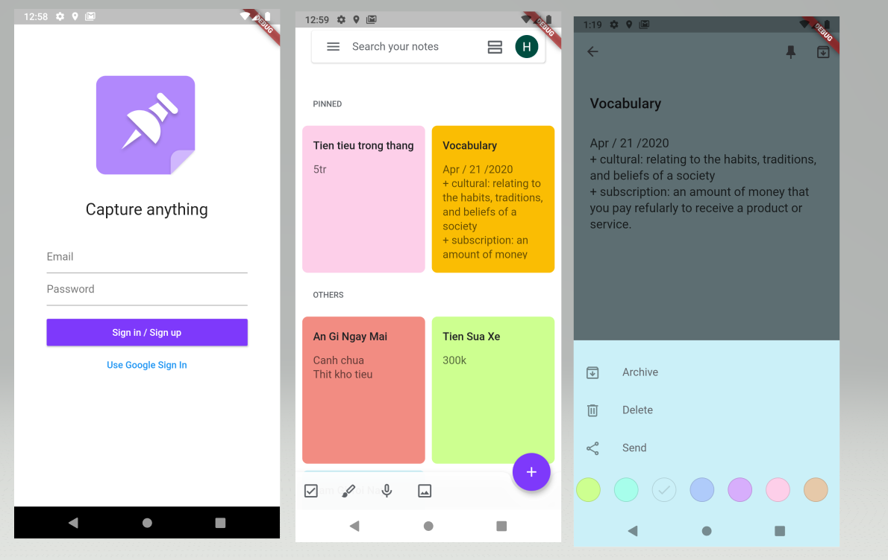

# Note_app
This is a simplified Google Keep mobile app 'clone' built with [Flutter] + [Firebase]. For practicing prototyping and Flutter skills only.

Screenshots:

[Video demo](https://youtu.be/gEEmkl99MSY)

# Features
 - Login Goolge and Email
 - Create - Delete - Update - Edit Notes
 - Show Notes with Grid/List view
 - Pined and Archived note.
 - Custom color for note
# Pattern
 Command pattern
  

#Reference
- [Build a note-taking app with Flutter + Firebase](https://medium.com/flutter-community/build-a-note-taking-app-with-flutter-firebase-part-i-53816e7a3788)
- [Github Repo](https://github.com/xinthink/flutter-keep)
- Author: Yingxin Wu

[Flutter]: https://flutter.dev
[Firebase]: https://firebase.google.com/